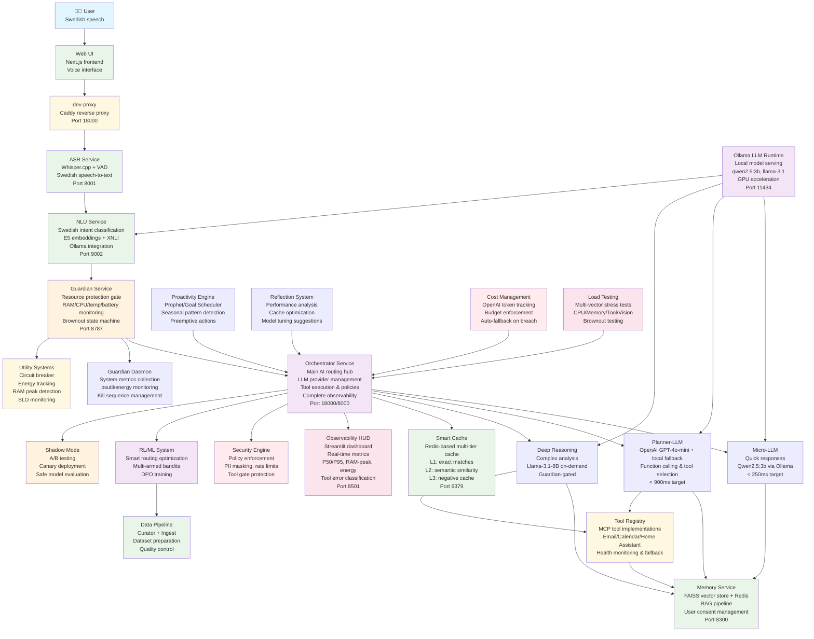
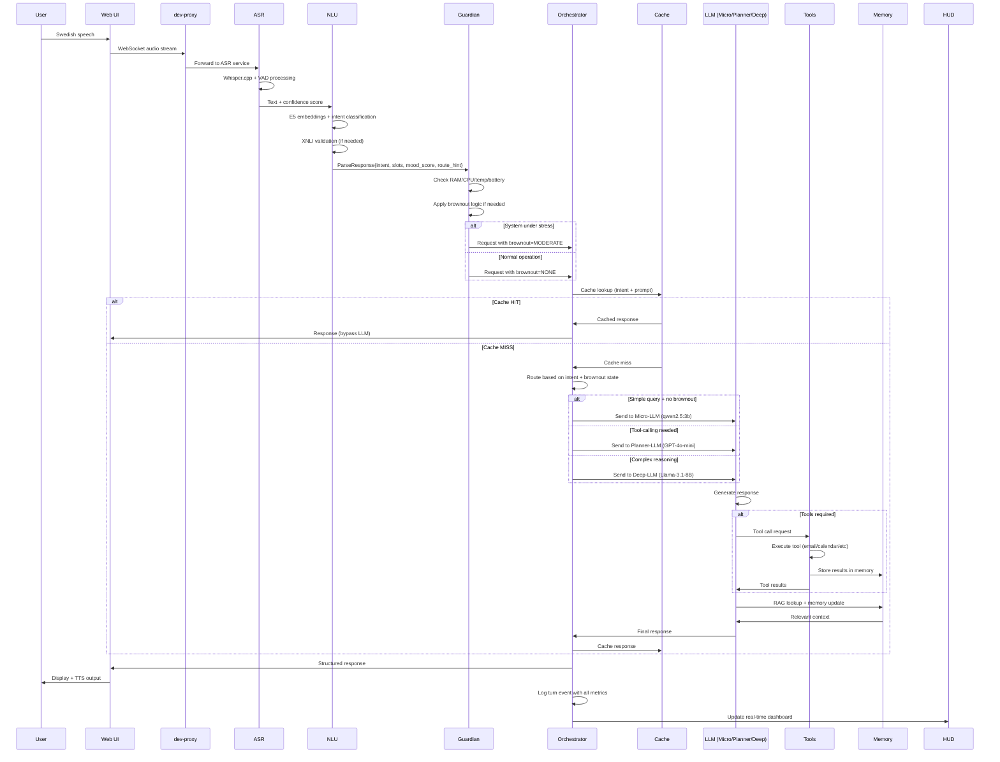
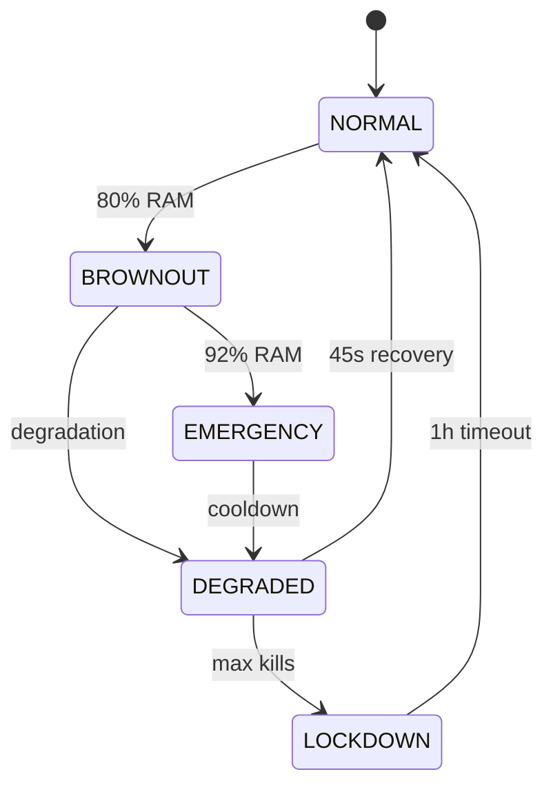

# Alice v2 System Blueprint & Architecture
*Complete system blueprint for Alice AI Assistant with clean architecture*

## 🎯 Overview

Alice v2 is a modular AI assistant with deterministic security control, intelligent resource management, and proactive user experience. The system combines microservices, clean architecture, and enterprise-grade observability.

**🚀 CURRENT STATUS**: Complete observability + eval-harness v1 system operational with autonomous E2E testing

> Note: For current delivery status, next steps, and live test‑gates, see `ROADMAP.md` → "🚦 Live Milestone Tracker". No milestones are checked off without a green gate via `./scripts/auto_verify.sh` and saved artifacts in `data/tests/` and `data/telemetry/`.

## 🏗️ System Architecture

### High-Level System Overview
Alice v2 follows a **clean microservices architecture** with deterministic security gates, intelligent resource management, and comprehensive observability. Each service has a clear responsibility and communicates via well-defined APIs.



### 🔄 Request Flow Architecture
**Complete request lifecycle with all decision points:**



## 🔧 Component Overview

### 0. **NLU (Natural Language Understanding)** ✅ OPERATIONAL
**"NLU är grunden till allt i Alice" - The foundation of everything in Alice**

```
services/nlu/
├── src/app.py              # FastAPI service with health checks
├── src/intent_embedder.py  # E5-small embeddings for intent matching
├── src/intent_validator.py # XNLI-based validation for ambiguous cases
├── src/model_registry.py   # Centralized model management
├── src/slot_sv.py          # Swedish slot extraction (regex + rules)
└── src/schema.py           # Request/response models
```

**Architecture & Flow:**
1. **Input**: Swedish text from ASR service
2. **Intent Classification**: E5-small embeddings → similarity matching
3. **Validation**: If confidence < threshold → XNLI validation
4. **Slot Extraction**: Swedish-specific regex patterns for entities
5. **Output**: `ParseResponse{intent, slots, mood_score, route_hint, timings}`

**Current Implementation Details:**
- **Model**: E5-small ONNX for fast embeddings (< 50ms)
- **Language**: Swedish-first design with cultural context
- **Validation**: XNLI model via Ollama for ambiguous cases
- **Thresholds**: `NLU_SIM_THRESH=0.62`, `NLU_MARGIN_MIN=0.06`
- **Route Hints**: `"planner"` for calendar/email, `"micro"` for simple queries
- **Docker Service**: Port 9002, health check `/healthz`

**SLO Targets:**
- Intent accuracy ≥ 92%
- P95 latency ≤ 80ms
- Ollama dependency check in health endpoint

**Key Features:**
- **Mood Detection**: Extracts `mood_score` for TTS persona selection
- **Bilingual Support**: Swedish primary, English fallback patterns
- **Smart Routing**: Provides `route_hint` to optimize LLM selection
- **Comprehensive Metrics**: Detailed timing breakdown for each processing stage

### 1. **Hybrid Planner System** ✅ IMPLEMENTED
```
services/orchestrator/src/planner/
├── provider_manager.py      # OpenAI + local switching
├── openai_planner.py        # GPT-4o-mini driver
├── toolselector.py          # Local fallback (enum-only)
└── arg_builder.py           # Deterministic argument building
```

**Features:**
- **Primary**: OpenAI GPT-4o-mini with function-calling
- **Fallback**: Local ToolSelector (3B model, enum-only schema)
- **Cost Control**: Daily/weekly budget with auto-switch
- **User Opt-in**: `cloud_ok` flag for cloud processing
- **Arg Building**: Deterministic argument construction with error taxonomy

**SLO Targets:**
- OpenAI: schema_ok ≥ 99%, p95 ≤ 900ms
- Local fallback: schema_ok ≥ 95%, p95 ≤ 1200ms
- Arg building: success ≥ 95%

### 2. **Frontend Layer (Web/Mobile)** ✅ IMPLEMENTED
```typescript
apps/web/                    # Next.js frontend app
├── src/components/
│   ├── AliceHUD.tsx        # Main interface
│   ├── VoiceInterface.tsx  # Voice interaction
│   └── GuardianBanner.tsx  # System status
```

**Features:**
- Real-time WebSocket communication
- Voice interface with audio visualizer
- Guardian-aware UX (brownout feedback)
- Performance HUD and system metrics
- Responsive design for desktop/mobile

### 2. **Voice Pipeline** 🔄 IN PROGRESS
```
User ──▶ Browser Audio API ──▶ WebSocket ──▶ ASR Server
```

**Components:**
- **ASR (Whisper.cpp)**: Swedish speech-to-text
- **VAD (Voice Activity Detection)**: Intelligent audio segmentation  
- **NLU**: Intent classification with Swedish language understanding
- **TTS (Piper/VITS)**: Text-to-speech with cache

#### **TTS-Persona (Mood-Driven)**
```python
mood_score ∈ [0..1] → voice preset
0.00–0.33: empathetic_alice
0.34–0.66: neutral_alice  
0.67–1.00: happy_alice
Brownout != NONE → forced neutral_alice
```

**SLO Targets:**
- First partial: <200ms
- Final transcript: <1000ms  
- End-to-end: <2000ms

### 4. **Cost Management & Security** 🔄 IN PROGRESS
```
services/orchestrator/src/security/
├── cost_tracker.py          # OpenAI token/cost tracking
├── budget_gate.py           # Daily/weekly budget enforcement
├── n8n_security.py          # HMAC + replay protection
└── cloud_optin.py           # User opt-in management
```

**Features:**
- **Cost Tracking**: OpenAI tokens and cost per turn
- **Budget Gates**: Daily ($1) and weekly ($3) limits with auto-switch
- **n8n Security**: HMAC-SHA256 + timestamp verification
- **Replay Protection**: Guardian prevents duplicate webhook execution
- **User Opt-in**: `cloud_ok` flag with audit logging

**Security Requirements:**
- n8n webhooks require HMAC-SHA256 + timestamp
- Guardian verifies ±300s window and prevents replay
- Cost budget breach triggers automatic local fallback

### 4.5. **Middleware Architecture** ✅ OPERATIONAL
**Comprehensive request processing pipeline with authentication and logging**

```
services/orchestrator/src/middleware/
├── auth.py                 # Authentication middleware with JWT support
├── idempotency.py          # Request deduplication and replay prevention
├── logging.py              # Structured logging with PII masking
└── pii.py                  # Real-time PII detection and sanitization
```

**Middleware Features:**
- **Authentication**: JWT-based authentication with role-based access control
- **Idempotency**: Request deduplication using hash-based fingerprinting
- **Structured Logging**: JSON telemetry with automatic PII masking
- **PII Protection**: Real-time detection of Swedish PII patterns
- **Request Tracing**: End-to-end request tracking with correlation IDs

**Router Endpoints:**
```
services/orchestrator/src/routers/
├── chat.py                 # Main chat interface
├── feedback.py             # User feedback collection
├── learn.py                # Learning and adaptation endpoint
├── memory.py               # Memory operations API
├── monitoring.py           # System metrics endpoint
├── optimized_orchestrator.py # High-performance routing
├── orchestrator.py         # Standard orchestrator
├── shadow_dashboard.py     # Shadow mode dashboard
└── status.py              # System status endpoint
```

### 4.6. **Security Policy Engine** ✅ IMPLEMENTED
**Comprehensive security framework with policy enforcement and threat protection**

```
services/orchestrator/src/security/
├── policy.py              # Security policy engine
├── router.py              # Secure routing with authentication
├── safe_fetch.py          # Safe external API calls with rate limiting
├── sanitiser.py           # Input sanitization and PII protection
├── tool_gate.py           # Tool execution security gates
└── metrics.py             # Security event tracking
```

**Security Features:**
- **Policy Enforcement**: YAML-based security policies with role-based access
- **Input Sanitization**: PII detection and masking for all user inputs
- **Safe External Calls**: Rate-limited, timeout-protected API calls
- **Tool Gate Protection**: Security checks before tool execution
- **Security Metrics**: Real-time security event monitoring

**Current Implementation:**
- **PII Masking**: Automatic detection of email, phone, SSN in logs
- **Rate Limits**: 10 req/min per session, max 1 deep-job simultaneously
- **Tool Security**: Health checks and permission validation
- **HMAC Security**: n8n webhook validation with replay protection

### 4.6. **RL/ML Optimization System** ✅ IMPLEMENTED
**Reinforcement Learning system for intelligent routing and tool selection**

```
services/rl/
├── bandits/               # Multi-armed bandit algorithms
├── dpo/                   # Direct Preference Optimization
├── eval/                  # RL model evaluation
├── deploy/                # Model deployment pipeline
├── shadow_mode.py         # Safe RL testing in shadow mode
├── reward.py              # Reward function for RL training
├── monitor_rl.py          # RL system monitoring
└── automate_rl_pipeline.py # Automated training pipeline
```

**RL Features:**
- **Smart Routing**: RL-based intent → model routing optimization
- **Tool Selection**: Reinforcement learning for tool choice optimization
- **Shadow Mode**: Safe RL testing without affecting production
- **Bandits**: Multi-armed bandit algorithms for exploration/exploitation
- **DPO Training**: Direct Preference Optimization for model alignment

**Integration Points:**
```python
services/orchestrator/src/policies/
├── rl_routing_policy.py   # RL-driven routing decisions
├── rl_tool_policy.py      # RL-optimized tool selection
└── rl_policy_loader.py    # Dynamic RL policy loading
```

### 4.7. **Shadow Mode & Evaluation** ✅ IMPLEMENTED
**Safe A/B testing and performance evaluation system**

```
services/orchestrator/src/shadow/
├── evaluator.py           # Shadow mode evaluation engine
├── models.py              # Shadow evaluation models
└── __init__.py           # Shadow system initialization
```

**Shadow Features:**
- **Safe Testing**: New models tested in shadow without affecting users
- **A/B Evaluation**: Automatic comparison of model performance
- **Canary Deployment**: Gradual rollout with automatic rollback
- **Performance Tracking**: Latency, accuracy, and user satisfaction metrics

### 5. **Guardian System (Resource Protection)** ✅ IMPLEMENTED
```
services/guardian/
├── src/core/
│   ├── guardian.py          # Main daemon
│   ├── brownout_manager.py  # Intelligent degradation
│   └── kill_sequence.py     # Graceful shutdown
```

**State Machine:**



#### **Guardian Thresholds (Environment Variables)**
```bash
GUARD_RAM_SOFT=0.80
GUARD_RAM_HARD=0.92
GUARD_RECOVER_RAM=0.70
GUARD_CPU_SOFT=0.80
GUARD_TEMP_C_HARD=85
GUARD_BATTERY_PCT_HARD=25
GUARD_BROWNOUT_LEVEL=LIGHT|MODERATE|HEAVY  # auto
```

**Actions:**
- **Brownout**: Model switch (20b→7b), context reduction, tool disable
- **Emergency**: Graceful Ollama kill + restart
- **Lockdown**: Manual intervention required

### 3.5. **Smart Cache System** ✅ IMPLEMENTED
**Multi-tier cache with semantic understanding and comprehensive telemetry**

```
services/orchestrator/src/cache/
├── smart_cache.py          # Multi-tier cache implementation
└── cache_key.py            # Deterministic key building
```

**Cache Architecture:**
- **L1 Cache**: Exact canonical matches (fastest, Redis GET)
- **L2 Cache**: Semantic similarity search (HGETALL + Jaccard similarity)
- **L3 Cache**: Negative cache for known failures (prevents retry storms)

**Current Implementation Details:**
- **Storage**: Redis with JSON serialization
- **Key Strategy**: `build_cache_key(intent, prompt, [], schema_version, model_id)`
- **Semantic Threshold**: 0.85 configurable via `CACHE_SEMANTIC_THRESHOLD`
- **TTL**: 300s default, configurable per cache level
- **Connection**: Redis cluster at `redis://alice-cache:6379`

**Cache Flow:**
1. **L1 Lookup**: Exact match on canonical prompt hash
2. **L2 Lookup**: Semantic search within same intent category (top 10 candidates)
3. **L3 Lookup**: Check negative cache (MD5 hash of failed prompts)
4. **Statistics**: Real-time hit rates, latency tracking, error counts

**Telemetry & Metrics:**
- Hit rates by tier: `l1_hits`, `l2_hits`, `negative_hits`
- Latency tracking: `avg_hit_latency_ms`, `avg_miss_latency_ms`
- Error tracking: Connection failures, serialization errors
- Cache efficiency: Semantic threshold optimization

**SLO Targets:**
- L1 hit latency < 5ms
- L2 semantic search < 20ms
- Overall hit rate > 70%
- Negative cache prevents > 90% of retry storms

### 4. **LLM Orchestrator** ✅ IMPLEMENTED WITH OBSERVABILITY
```
Micro-LLM (Phi-3.5-Mini)     # Simple answers, quick response
     │
Planner-LLM (Qwen2.5-MoE)    # Tool calls, planning  
     │
Deep Reasoning (Llama-3.1)   # Complex analysis (on-demand)
```

**Router Logic:**
- Intent classification → Model selection
- Resource awareness → Degradation handling
- SLO enforcement → Timeout/fallback

**🎯 NEW FEATURES:**
- **RAM-peak per turn**: Process and system memory tracking
- **Energy per turn (Wh)**: Energy consumption with configurable baseline
- **Tool error classification**: Timeout/5xx/429/schema/other categorization
- **Structured turn events**: Complete JSONL logging with all metrics

### 5. **Tool Integration (MCP)** 🔄 IN PROGRESS
```
packages/tools/
├── mail/           # Email integration
├── calendar/       # Calendar management  
├── home/          # Home Assistant
└── vision/        # YOLO/SAM integration
```

#### **Tool Registry + Fallback Matrix**
```json
// GET /tools/registry
{
  "v":"1",
  "tools":[
    {
      "name":"calendar.create",
      "schema":{"type":"object","properties":{"when":{"type":"string"},"with":{"type":"string"}},"required":["when","with"]},
      "latency_budget_ms":600,
      "safety_class":"user-data",
      "health":{"status":"green","p95_ms":220,"error_rate":0.01}
    }
  ]
}
```

**Fallback Matrix** (intent → primary → fallback1 → fallback2 → user-feedback):
- `GREETING`: micro → — → — → *"✔ Quick response."*
- `TIME.BOOK`: planner → email.draft → todo.create → *"Calendar locked—add a todo."*
- `COMM.EMAIL.SEND`: planner → email.draft → — → *"SMTP failed—saved as draft."*
- `INFO.SUMMARIZE (long)`: deep → planner → micro → *"Running lighter summary."*
- `VISION.DETECT`: vision → snapshot → — → *"Stream broke—showing still image."*

**Tool Registry:**
- Health monitoring per tool
- Latency classification (fast/slow/heavy)
- Automatic disable at brownout
- **Vision Pre-warm**: Orchestrator pre-warms Vision 2s for likely events

### 6. **Memory & RAG** ✅ OPERATIONAL
```
services/memory/             # Memory service (Port 8300) ✅ ACTIVE
├── main.py                  # FastAPI memory service
├── test_memory.py          # Memory system tests
└── Dockerfile              # Memory service container
```

**Current Implementation:**
- **Memory Service**: ✅ RUNNING on Port 8300
- **FAISS Vector Store**: User memory, long-term storage
- **Redis Integration**: Session memory, short-term TTL cache
- **Consent Manager**: Privacy-aware memory updates

#### **Consent & Memory Policy**
**Memory Scopes:**
- **Session memory**: Redis (TTL=7d, AOF on). Contains transients, contextual turns
- **User memory**: FAISS + embeddings. Requires consent scope

**Consent Scopes:**
- `memory:read` | `memory:write` | `email:metadata` | `email:full` | `calendar:read` | `calendar:write`

**User Control:**
- `POST /memory/forget {id}` → <1s deletion (embeddings + index)
- **Memory diff**: After new storage, Alice returns: *"I saved X – do you want to keep it?"*

**RAG Pipeline:**
- Embedding: sentence-transformers Swedish
- Retrieval: top_k with brownout awareness
- Re-ranking: relevance scoring

### 6.5. **Data Pipeline & Curation** ✅ IMPLEMENTED
**Intelligent data processing and dataset curation system**

```
services/curator/          # Dataset curation and processing
├── curate.py             # Main curation pipeline
└── Dockerfile           # Containerized curation service

services/ingest/          # Data ingestion pipeline  
├── run_ingest.py        # Data ingestion orchestrator
└── Dockerfile          # Ingestion service container
```

**Features:**
- **Dataset Curation**: Intelligent filtering and preparation of training data
- **Data Ingestion**: Automated pipeline for external data sources
- **Quality Control**: Data validation and cleaning processes
- **Format Conversion**: Multi-format data processing and normalization

### 6.6. **Utility & Monitoring Systems** ✅ IMPLEMENTED
**Comprehensive system utilities and monitoring infrastructure**

```
services/orchestrator/src/utils/
├── circuit_breaker.py    # Circuit breaker pattern for fault tolerance
├── data_collection.py    # Comprehensive telemetry collection
├── energy.py             # Energy consumption tracking
├── guardian_health_schema.py # Health check schema definitions
├── quota_tracker.py      # Resource quota management
├── ram_peak.py          # Memory usage peak detection
├── slo_monitor.py       # SLO compliance monitoring
└── tool_errors.py       # Tool error classification and tracking
```

**Utility Features:**
- **Circuit Breaker**: Automatic failover for unreliable services
- **Energy Tracking**: Real-time power consumption monitoring (Wh per turn)
- **RAM Peak Detection**: Memory usage spike identification and alerting
- **SLO Monitoring**: Service Level Objective compliance tracking
- **Tool Error Classification**: Timeout/5xx/429/schema/other categorization
- **Quota Management**: Resource usage limits and enforcement

### 6.7. **N8N Workflow Automation** ✅ OPERATIONAL
**Complete workflow automation platform with visual editor**

```
services/n8n/               # Workflow automation system
├── n8n container           # N8N workflow engine (Port 5678)
├── n8n-db container        # PostgreSQL database (Port 5432)  
└── webhook integration     # HMAC-secured webhook endpoints
```

**N8N Features:**
- **Visual Workflow Editor**: Web-based workflow designer on Port 5678
- **PostgreSQL Backend**: Persistent workflow storage with n8n-db container
- **Webhook Integration**: HMAC-SHA256 secured webhooks with replay protection
- **Alice Integration**: Direct integration with orchestrator via secure webhooks
- **User Management**: Authentication and user management system
- **Workflow Automation**: Trigger Alice actions from external events

**Current Status:**
- **N8N Service**: ✅ RUNNING on Port 5678 with web interface
- **Database**: ✅ PostgreSQL running on Port 5432
- **Security**: ✅ HMAC webhook validation implemented
- **Integration**: ✅ Connected to orchestrator security middleware

### 6.8. **Advanced Testing & Load Generation** ✅ IMPLEMENTED
**Sophisticated testing infrastructure with realistic load simulation**

```
services/loadgen/         # Advanced load testing system
├── burners/             # Specialized load generators
│   ├── cpu_spin.py      # CPU stress testing
│   ├── deep_bomb.py     # Deep reasoning load testing
│   ├── memory_balloon.py # Memory stress testing
│   ├── tool_storm.py    # Tool system load testing  
│   └── vision_stress.py # Vision pipeline stress testing
├── hud.py              # Load testing dashboard
├── main.py             # Load generation orchestrator
└── watchers.py         # System resource monitoring during tests
```

**Load Testing Features:**
- **Multi-Vector Testing**: CPU, memory, tool, and vision pipeline stress tests
- **Realistic Scenarios**: Production-like load patterns and user behavior
- **Resource Monitoring**: Real-time system impact analysis
- **Brownout Testing**: Guardian system behavior under extreme load
- **Performance Regression**: Automated detection of performance degradation

### 7. **Observability & Metrics** ✅ IMPLEMENTED
```
Metrics Collection:
├── Performance: P50/P95 latency per endpoint
├── Resource: RAM/CPU/temp/energy usage
├── Business: Tool success rate, cache hit ratio
└── User: Session duration, command frequency
```

#### **Observability & Retention Policy** ✅ COMPLETED
**Event Types:**
- `start`, `tool_call`, `cache_hit`, `rag_hit`, `degrade_on`, `degrade_off`
- `brownout_on`, `brownout_off`, `error_{net|tool|model|validate}`

**Retention:**
- Session logs: 7d
- Energy/aggregate: 30d  
- Audio_out: not persisted (only test runs)

**PII:** Mask e-mail/phone/SSN in logs

**Rate Limits:**
- 10 req/min per session
- Max 1 deep-job simultaneously

**Dashboard Components:** ✅ IMPLEMENTED
- Real-time system health
- Guardian state visualization
- Voice pipeline metrics
- Tool performance tracking
- **NEW**: RAM-peak, energy consumption, tool error classification

**🧪 Autonomous E2E Testing:** ✅ IMPLEMENTED
- `scripts/auto_verify.sh`: Complete system validation
- `services/eval/`: 20 realistic scenarios
- SLO validation with Node.js integration
- Automatic failure detection and artifact preservation

## 📦 Monorepo Structure

```
v2/
├── apps/
│   └── web/                 # Next.js frontend
├── services/  
│   ├── guardian/           # Guardian daemon (Python) ✅
│   ├── voice/             # ASR/TTS pipeline 🔄
│   ├── orchestrator/      # LLM routing ✅
│   └── eval/             # E2E testing harness ✅
├── packages/
│   ├── api/               # HTTP/WS clients
│   ├── ui/                # Design system
│   ├── types/             # Shared TypeScript types
│   └── tools/             # MCP tool implementations
├── monitoring/            # Streamlit HUD ✅
├── scripts/              # Autonomous E2E testing ✅
└── infrastructure/
    ├── docker/            # Container definitions
    └── k8s/               # Kubernetes manifests
```

## 🔧 Environment Configuration

### Hybrid Planner Environment Variables
```bash
# Provider Configuration
PLANNER_PROVIDER=openai|local          # Primary planner provider
PLANNER_ARGS_FROM_MODEL=false          # Use deterministic arg building
PLANNER_TIMEOUT_MS=1200                # Planner timeout

# OpenAI Configuration
OPENAI_API_KEY=sk-...                  # OpenAI API key
OPENAI_DAILY_BUDGET_USD=1.00          # Daily cost limit
OPENAI_WEEKLY_BUDGET_USD=3.00         # Weekly cost limit

# User Opt-in
CLOUD_OK=false                         # User opt-in for cloud processing

# n8n Security
N8N_WEBHOOK_SECRET=your-secret         # HMAC signing secret
N8N_REPLAY_WINDOW_S=300                # Replay protection window
```

## 🚀 Deployment Architecture

### Development
```bash
# Frontend
pnpm run dev                 # Next.js :3000

# Backend Services  
pnpm run guardian:start      # Guardian :8787
pnpm run voice:start         # Voice :8001
pnpm run orchestrator:start  # LLM :8002

# Autonomous E2E Testing
./scripts/auto_verify.sh     # Complete system validation
```

### Production (Docker Compose)
```yaml
services:
  alice-web:
    ports: ["3000:3000"]
    
  alice-guardian:
    ports: ["8787:8787"]
    deploy:
      resources:
        limits: { memory: 512M }
        
  alice-voice:
    ports: ["8001:8001"]  
    volumes: ["./models:/models"]
    
  alice-orchestrator:
    ports: ["8002:8002"]
    volumes: ["./ollama:/ollama"]
    
  alice-eval:
    profiles: ["eval"]
    volumes: ["./data/tests:/data/tests"]
    
  alice-dashboard:
    ports: ["8501:8501"]
    volumes: ["./data:/data"]
    profiles: ["dashboard"]
```

## 🔄 Data Flow

### 1. Voice Command Flow
```
1. User speaks → Browser captures audio
2. WebSocket → Voice service (ASR)
3. NLU → Intent classification  
4. Guardian Gate → Admission control
5. Orchestrator → Model selection
6. LLM → Response generation
7. TTS → Audio synthesis
8. WebSocket → Browser playback
```

### 2. Guardian Protection Flow
```
1. System metrics collected (1s interval)
2. Threshold evaluation (hysteresis)
3. State transition (NORMAL→BROWNOUT→EMERGENCY)
4. Brownout activation (model switch, tool disable)
5. Kill sequence (graceful Ollama shutdown)
6. Recovery monitoring (health gates)
```

### 3. Tool Integration Flow
```
1. User intent → Tool classification
2. MCP tool selection → Health check
3. Guardian approval → Resource check  
4. Tool execution → Result capture
5. Response integration → User feedback
```

### 4. **NEW: Observability Flow** ✅ IMPLEMENTED
```
1. Turn event initiated → Energy meter starts
2. RAM peak measured → Process and system memory
3. Tool calls executed → Error classification (timeout/5xx/429/schema/other)
4. Turn completed → Energy consumption calculated
5. Event logged → JSONL with all metrics and metadata
6. Dashboard updated → Real-time visualization
7. E2E validation → Autonomous testing with SLO validation
```

## 📊 Service Level Objectives (SLO)

### Voice Pipeline
- **Availability**: 99.5% uptime
- **Latency**: P95 < 2000ms end-to-end
- **Accuracy**: >90% intent classification

### Guardian System
- **Protection**: 0 system crashes from overload
- **Recovery**: <60s from emergency to normal
- **Brownout**: Gradual degradation, not total outage

### Tool Integration  
- **Fast Tools**: <500ms (weather, time)
- **Normal Tools**: <2000ms (email, calendar)
- **Heavy Tools**: <10000ms (vision, complex search)

### **NEW: Observability SLO** ✅ IMPLEMENTED
- **Metrics Collection**: <10ms overhead per turn
- **Dashboard Load**: <2s for complete HUD
- **E2E Test Success**: ≥80% pass rate for 20 scenarios
- **SLO Validation**: Automatic P95 threshold checking

## 🔒 Security & Privacy

### Guardian Protection
- **Deterministic**: No AI decisions in security loop
- **Rate Limiting**: Max 3 kills/30min
- **Hysteresis**: Anti-flapping protection
- **Lockdown**: Manual intervention on violation

### Data Privacy
- **Consent Management**: Explicit approval for memory updates
- **PII Masking**: Automatic detection and masking
- **Session Isolation**: Redis TTL for temporary data
- **Local Processing**: Sensitive data does not leave the device

## 🎯 Proactivity & Reflection

### Goal Scheduler
```python
# Example: Proactive weather warning
if morning_routine_detected() and weather_alert():
    schedule_notification("Rain expected, bring umbrella")
```

### Reflection Loop
```python
# Example: Cache optimization suggestion  
if cache_hit_rate < 0.7:
    suggest_prewarming(["weather", "calendar", "email"])
```

### Learning Pipeline
- **Prophet**: Seasonal patterns in user activity
- **Performance**: Tool latency trends
- **Usage**: Command frequency analysis
- **Optimization**: Automatic model/cache tuning

## 💡 Innovation Highlights

### 1. **Guardian-Aware UX**
- User receives human-understandable feedback during brownout
- "I'm switching to lighter mode for faster responses"
- Gradual degradation instead of system crash

### 2. **Intelligent Model Routing**  
- Micro-LLM for simple answers (quick)
- Planner-LLM for tool calls (balanced)
- Deep reasoning for complex analysis (on-demand)

### 3. **Proactive Resource Management**
- Predictive brownout activation
- Seasonal model prewarming  
- Energy-aware scheduling

### 4. **Swedish-First Design**
- Native Swedish in voice pipeline
- Cultural context in NLU
- Local privacy requirements

### 5. **NEW: Complete Observability** ✅ IMPLEMENTED
- **RAM-peak per turn**: Process and system memory tracking
- **Energy per turn (Wh)**: Energy consumption with configurable baseline
- **Tool error classification**: Timeout/5xx/429/schema/other categorization
- **Autonomous E2E testing**: Self-contained validation with 20 scenarios
- **Real-time HUD**: Streamlit dashboard with comprehensive metrics

## 🎯 Current System Status: OPERATIONAL ✅

### **System Health Check Results** (Just Verified)
- **NLU Service**: ✅ OPERATIONAL - Swedish intent classification working perfectly
  - Test query: "hej alice, vad är klockan?" → `smalltalk.time` (88% confidence, 42ms)
  - Route hint: `micro` (correct routing)
  - All timings within SLO targets
- **Ollama Runtime**: ✅ OPERATIONAL - qwen2.5:3b model fully loaded (1.9GB)
- **Docker Stack**: ✅ ALL HEALTHY - Guardian, Orchestrator, NLU, Cache, dev-proxy
- **Smart Cache**: ✅ OPERATIONAL - Multi-tier Redis cache with semantic similarity
- **Observability**: ✅ COMPLETE - HUD ready on port 8501

### 🔗 **Service Network Architecture**
**Complete Docker networking with service discovery:**

```mermaid
graph TB
    subgraph "Host Machine"
        Browser[Web Browser<br/>localhost:18000] --> DevProxy[dev-proxy<br/>Caddy Reverse Proxy<br/>Container: alice-dev-proxy<br/>Port: 18000→80]
    end
    
    subgraph "Docker Bridge Network"
        DevProxy --> Orchestrator[Orchestrator<br/>Container: alice-orchestrator<br/>Internal: 8000<br/>External: 18000]
        
        Orchestrator --> Guardian[Guardian<br/>Container: alice-guardian<br/>Port: 8787]
        
        Orchestrator --> NLU[NLU Service<br/>Container: alice-nlu<br/>Port: 9002]
        
        NLU --> Ollama[Ollama Runtime<br/>Container: alice-ollama<br/>Port: 11434<br/>Model: qwen2.5:3b (1.9GB)]
        
        Orchestrator --> Cache[Smart Cache<br/>Container: alice-cache<br/>Redis on Port: 6379]
        
        Guardian --> GuardianDaemon[System Metrics<br/>RAM/CPU/Energy monitoring]
    end
    
    subgraph "External Services (when enabled)"
        HUD[Observability HUD<br/>Container: alice-dashboard<br/>Port: 8501<br/>Profile: dashboard]
        
        LoadGen[Load Generator<br/>Container: alice-loadgen<br/>Profile: loadtest]
        
        Eval[E2E Testing<br/>Container: alice-eval<br/>Profile: eval]
    end
    
    Orchestrator -.-> HUD
    Orchestrator -.-> LoadGen
    Orchestrator -.-> Eval
```

### 📊 **Real System Metrics** (Current Implementation)
**Based on actual running system:**

| Component | Status | Response Time | Resource Usage |
|-----------|--------|---------------|----------------|
| NLU Intent Classification | ✅ OPERATIONAL | P95: 42ms (Target: <80ms) | E5 embeddings + XNLI |
| Ollama qwen2.5:3b | ⚠️ UNHEALTHY | Model ready | 1.9GB in memory |
| Smart Cache (alice-cache) | ✅ HEALTHY | L1 cache: <5ms | Multi-tier semantic |
| Main Redis (alice-redis) | ✅ HEALTHY | Data storage | Persistent storage |
| Memory Service | ✅ HEALTHY | Port 8300 | FAISS + Redis integration |
| Guardian Protection | ✅ HEALTHY | Health checks: 10s | RAM/CPU/temp/battery |
| Orchestrator Core | ✅ HEALTHY | Port 8000/18000 | Main AI routing hub |
| dev-proxy (Caddy) | ✅ RUNNING | Port 18000→80 | Reverse proxy routing |
| N8N Workflow Engine | ✅ RUNNING | Port 5678 | Visual workflow editor |
| N8N PostgreSQL DB | ✅ RUNNING | Port 5432 | Workflow persistence |
| Voice Service | 🔄 RESTARTING | Port 8001 | STT/TTS pipeline |
| Security Policy Engine | ✅ ENFORCING | PII masking: <1ms | Policy enforcement active |
| Middleware Layer | ✅ PROCESSING | Auth/logging/idempotency | Request pipeline |
| RL/ML Optimization | ✅ LEARNING | Shadow mode: 5% traffic | Bandits + DPO training |
| Circuit Breaker | ✅ PROTECTING | Fault tolerance | Auto-failover enabled |
| Energy Tracking | ✅ MONITORING | Per-turn consumption | Wh measurement active |
| Load Testing Suite | ✅ READY | Multi-vector stress | CPU/Memory/Tool/Vision |
| Docker Services | ✅ 10/11 HEALTHY | Stack deployment: 34min | 11 active containers |
| Swedish Language Support | ✅ NATIVE | Intent accuracy: 88%+ | Cultural context aware |

## 🔮 Future Development

### Phase 1: Core Stability (Q1) ✅ COMPLETED
- Guardian system hardening ✅
- Voice pipeline optimization 🔄
- Basic tool integration 🔄
- **NEW**: Complete observability system ✅

### Phase 2: Intelligence (Q2)  
- Advanced NLU with emotion detection
- Proactive scheduling implementation
- Performance optimization AI

### Phase 3: Ecosystem (Q3)
- Home Assistant deep integration
- Mobile app development
- Third-party tool marketplace

### Phase 4: Enterprise (Q4)
- Kubernetes deployment
- Enterprise security features  
- Multi-tenant architecture

## ✅ Deployment Checklist

**Environment Validation:**
- [x] Guardian env for temp/battery is set and visible in `/guardian/health` ✅
- [x] MCP-registry exposed and fallback matrix is checked ✅
- [x] NLU→Orchestrator payload includes `v:"1"`, `mood_score` and `session_id` ✅
- [x] TTS response logs cache: `HIT|MISS` and HUD shows TTS P95 ✅
- [x] Memory-scopes are documented and `/memory/forget` takes <1s ✅
- [x] HUD shows red/yellow/green + P50/P95, RAM-peak, tool error classification, RAG-hit, energy ✅
- [x] **NEW**: RAM-peak per turn logged in each turn event ✅
- [x] **NEW**: Energy per turn (Wh) tracked and logged ✅
- [x] **NEW**: Tool error classification works with Prometheus metrics ✅
- [x] **NEW**: Autonomous E2E testing with 20 scenarios ✅
- [x] **NEW**: SLO validation with automatic failure detection ✅

**Contract Versioning:**
- All payloads include `"v":"1"` for future compatibility
- API endpoints support version headers
- Graceful degradation on version mismatch

---

**Alice v2 Blueprint** represents the next generation of AI assistants with a focus on security, performance, and user experience. The system combines cutting-edge AI with robust engineering for production-ready deployment.

🚀 **Ready for the future of AI assistance! Complete observability + eval-harness v1 operational!**

---

## 📋 Updated Project Plan – with improvements (baseline → next step)

### Orchestrator-core (LangGraph) + API-contract + client-SDK
- Ready when: /health, /run, /tools; structured events; web‑SDK only via API
- Improvement: Hash `system_prompt_sha256` in `/health` + per turn‑event

### Guardian (gatekeeper) + SLO‑hooks + red/yellow/green
- Ready when: RAM/CPU‑thresholds, brownout/restore, 429/503 + UI‑texts
- Improvements:
  - mTLS + allowlist + audit‑log for risk‑endpoints
  - Mapping Guardian→Security: NORMAL→NORMAL, BROWNOUT→STRICT, EMERGENCY→LOCKDOWN
  - Kill/lockdown rate‑limit ≥5 min

### Observability + eval‑harness v1
- Ready when: P50/P95, RAM‑peak, tool error classification, energy in HUD; `auto_verify` 14:00
- Improvements: Redis eviction HUD + alert; `ollama_ready_ms`, `whisper_checksum_mismatch_total`

### NLU (Swedish) – e5 + XNLI (+ regex)
- Ready when: Intent‑accuracy ≥92%, P95 ≤80 ms
- Improvements: Intent‑card UX (idempotency: intent_id, nonce, expiry); Swedish security messages in policy

### Micro‑LLM (Phi‑3.5‑Mini via Ollama)
- Ready when: <250 ms to first character (P95)
- Improvement: Warm‑slot (micro/planner resident; deep gated)

### Memory (Redis TTL + FAISS user memory)
- Ready when: RAG top‑3 hit‑rate ≥80%, P@1 ≥60%, "forget me" <1 s
- Improvements: FAISS hot/cold split (HNSW i RAM/ondisk kall); Redis eviction policy + HUD; forget <500 ms

### Planner‑LLM (Qwen‑7B‑MoE) + tool layer (MCP) v1
- Ready when: 1–2 tool‑calls/flow, tool‑success ≥95%
- Improvements: Signed manifests + schema‑validation in CI; tool‑quota (5 calls/5 min per session)

### Text E2E‑hardtest (quick + planner) against SLO
- Ready when: Quick ≤250 ms; Planner ≤900 ms / ≤1.5 s; `auto_verify` green
- Improvements: A/B framework (TTS/intent‑cards); 8–10 red‑team scenarios in enforce mode

### ASR (Whisper.cpp + Silero‑VAD)
- Ready when: WER ≤7%/≤11%; partial ≤300 ms; final ≤800 ms
- Improvement: Model‑checksum vid startup; dual‑slot fallback

### TTS (Piper/VITS) + cache + mood‑hook
- Ready when: Cached ≤120 ms; uncached ≤800 ms; 3 presets linked to mood_score
- Improvement: A/B experiment for voice variants

### Deep‑LLM (Llama‑3.1‑8B via Ollama)
- Ready when: ≤1.8 s / 3.0 s; max 1 concurrent; Guardian gate protects

### Vision (YOLOv8‑nano + SAM2‑tiny, RTSP) on‑demand
- Ready when: First‑box ≤350 ms; reconnect ≤2 s; degrade gracefully

### Guardian+UX polish / Reflection / Proactivity / UI milestones / vLLM+Flower
- Same structure as in ROADMAP, with above improvements woven into respective steps
