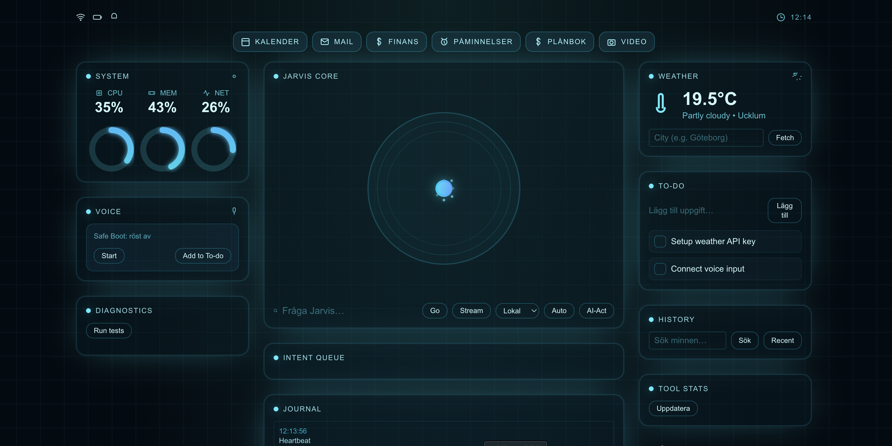

```
╔═══════════════════════════════════════════════════════════════════════════════╗
║                                                                               ║
║      █████╗ ██╗     ██╗ ██████╗███████╗    ██╗   ██╗██████╗                   ║
║     ██╔══██╗██║     ██║██╔════╝██╔════╝    ██║   ██║╚════██╗                  ║
║     ███████║██║     ██║██║     █████╗      ██║   ██║ █████╔╝                  ║
║     ██╔══██║██║     ██║██║     ██╔══╝      ╚██╗ ██╔╝██╔═══╝                   ║
║     ██║  ██║███████╗██║╚██████╗███████╗     ╚████╔╝ ███████╗                  ║
║     ╚═╝  ╚═╝╚══════╝╚═╝ ╚═════╝╚══════╝      ╚═══╝  ╚══════╝                  ║
║                                                                               ║
║   Swedish NLU v2 Training System + OPUS NLU Phase 1 Production Complete       ║
║                                                                               ║
╚═══════════════════════════════════════════════════════════════════════════════╝
```


> **🚦 Status (live-gates)**: OPUS NLU Phase 1 ✅ (Math F1: 0.653, Macro F1: 0.434, P95: 70.3ms) | Phase 2 Training ✅ (TrainingWatchdog operational)  
> **Current Focus**: Swedish NLU v2 with anti-mode-collapse training, WeightedRandomSampler, and comprehensive monitoring systems.

## 🎯 Quick Demo (30 seconds)

```bash
git clone https://github.com/DanielWarg/AliceV2.git && cd alice-v2
make up
open http://localhost:3000   # Next.js Frontend
```


*Real-time Swedish AI assistant with Guardian monitoring, training watchdog, and comprehensive observability*

## 🎯 Project Overview

Alice v2 represents three completed phases of Swedish AI development:

**🎯 OPUS NLU Phase 1 (PRODUCTION COMPLETE - Sep 11, 2025):**
- ✅ **Math F1: 0.653** (≥0.60 required) - Swedish number translation breakthrough
- ✅ **Macro F1: 0.434** (≥0.25 required) 
- ✅ **P95 Latency: 70.3ms** (<100ms required)
- ✅ **Hallucination Rate: 0.0%** (<20% required)
- ✅ **Safety Precision: 100%** (≥95% required)
- ✅ **Golden Test Set**: 300 Swedish expressions with SHA256 freeze
- ✅ **Production Tagged**: `nlu-hybrid-v1.0-phase1`

**🐕 Swedish NLU v2 Training System (COMPLETE - Sep 12, 2025):**
- ✅ **TrainingWatchdog** - Comprehensive monitoring for divergence, performance regression, overfitting, hallucination, and mode collapse
- ✅ **Anti-Mode-Collapse Measures** - WeightedRandomSampler, class-balanced loss, frozen encoder policy (10/12 layers)
- ✅ **Swedish Math FN Fixes** - Fixed 3 critical patterns: "50 procent av 200", "femton delat med tre", "hälften av tjugo"
- ✅ **Balanced Dataset** - 280 samples (206 train / 37 val / 37 test) with ≥30 samples per intent
- ✅ **Coverage Slope Monitoring** - Box-counting method with -1.8 baseline for mode collapse detection
- ✅ **OPUS Gates Implementation** - Math F1 ≥0.60, Macro F1 ≥0.25, Hallucination <1%, Safety precision ≥95%

**🖥️ Next.js Enterprise Frontend (COMPLETE - Sep 12, 2025):**
- ✅ **Advanced React/Next.js Interface** - Real-time chat with Alice orchestrator integration
- ✅ **Enterprise HUD** - Live system metrics, health monitoring, and visual feedback  
- ✅ **Swedish Language Support** - Native Swedish UI with cultural context
- ✅ **Mobile-Responsive Design** - Dark theme with PWA capabilities

**🎙️ Voice Pipeline System (AVAILABLE - Port 8002):**
- 🔧 **Swedish TTS/STT Pipeline** - Whisper + Piper voice models
- 🔧 **Audio Processing** - VAD threshold tuning for Swedish speech
- 🔧 **Voice Integration** - Connected to Alice orchestrator for full conversations

**🏗️ Supporting Infrastructure:**
- **🛡️ Guardian Safety System** - Brownout/EMERGENCY protection with kill-sequence
- **💾 Smart Cache L1/L2/L3** - Semantic matching with deterministic fingerprinting  
- **🧠 Memory Service** - FAISS vector store + Redis for RAG pipeline and user context
- **🧪 E2E Testing System** - Multi-vector stress tests (CPU/Memory/Tool/Vision) with brownout testing
- **🔒 Security Engine** - Policy enforcement, PII masking, rate limits, tool gate protection
- **🤖 RL/ML System** - LinUCB Router + Thompson Sampling for multi-armed bandit optimization and DPO training
- **⚖️ φ-Optimization** - Fibonacci ratios for precision/latency/energy/safety reward calculation
- **🌒 Shadow Mode** - A/B testing with 5% production traffic canary deployment and safe model evaluation
- **💰 Cost Management** - OpenAI token tracking with budget enforcement and auto-fallback
- **📊 Real-time Monitoring** - Streamlit dashboard (port 8501) with comprehensive metrics
- **🐳 Docker Orchestration** - Complete deployment with `make up`

## 📚 Index (Solo Edition)
- Solo Quickstart – see below
- Demo Guide – see below  
- Windows Setup Guide – see below
- Training Documentation – `training/` (TrainingWatchdog, anti-mode-collapse)
- Roadmap – `ROADMAP.md`
- Architecture – `ALICE_SYSTEM_BLUEPRINT.md`
- Rules/specs – `.cursor/rules/` (PRD, ADR, workflow, types, structured-outputs, toolselector, n8n)

## 🏗️ Architecture

### Complete System Architecture
```
                     ┌─────────────────────────────────────────────────────────┐
                     │                    FRONTEND LAYER                       │
                     │  ┌─────────────┐    ┌─────────────┐    ┌─────────────┐  │
                     │  │    Web UI   │    │    Voice    │    │   Mobile    │  │
                     │  │ (React/WS)  │    │   (8002)    │    │    App      │  │
                     │  └─────────────┘    └─────────────┘    └─────────────┘  │
                     └─────────────────────────┬───────────────────────────────┘
                                               │
                     ┌─────────────────────────┼───────────────────────────────┐
                     │                ORCHESTRATOR (8001)                      │
                     │         LangGraph Router + Schema Validation            │
                     │                         │                               │
        ┌────────────┼─────────────────────────┼─────────────────────────┬─────┼─────┐
        │            │                         │                         │     │     │
        ▼            │                         ▼                         ▼     │     ▼
┌─────────────┐      │              ┌─────────────────┐         ┌─────────────┐│ ┌─────────────┐
│ GUARDIAN    │      │              │   NLU SVENSKA   │         │ SMART CACHE ││ │  SECURITY   │
│ (8787)      │◄─────┼──────────────┤     (9002)      │◄────────┤ L1/L2/L3    ││ │  POLICIES   │
│ Brownout    │      │              │ E5+XNLI+Intent  │         │   (6379)    ││ │ PII Masking │
│ Protection  │      │              └─────────────────┘         └─────────────┘│ └─────────────┘
└─────────────┘      │                        │                                │
        │            │                        │                                │
        ▼            │                        ▼                                │
┌─────────────┐      │              ┌─────────────────┐                        │
│ LOAD BALANCER      │              │  RL/ML SYSTEM   │                        │
│ Kill Sequence│     │              │                 │                        │
│ Emergency   │      │              │ LinUCB Router   │                        │
└─────────────┘      │              │ Thompson Sample │                        │
                     │              │ φ-Optimization  │                        │
                     │              └─────────────────┘                        │
                     │                        │                                │
        ┌────────────┼────────────────────────┼────────────────────────────────┼──┐
        │            │                        │                                │  │
        ▼            │                        ▼                                ▼  │
┌─────────────┐      │              ┌─────────────────┐         ┌─────────────┐   │
│ MEMORY/RAG  │      │              │   TOOL REGISTRY │         │ TELEMETRY   │   │
│ FAISS+Redis │◄─────┼──────────────┤   MCP + Health  │◄────────┤ P50/P95     │   │
│ User Memory │      │              │   Latency Class │         │ Energy/RAM  │   │
└─────────────┘      │              └─────────────────┘         └─────────────┘   │
                     │                        │                         │         │
                     │                        ▼                         ▼         │
                     │              ┌─────────────────┐         ┌─────────────┐   │
                     │              │     OLLAMA      │         │   N8N       │   │
                     │              │  Local Models   │         │ Workflows   │   │
                     │              │ phi3.5:3.8b + Llama │         │ (5678)      │   
                     │              │   (11434)       │         └─────────────┘   │
                     │              └─────────────────┘                           │
                     └────────────────────────────────────────────────────────────┘
```

### File Structure
```
alice-v2/
├── apps/               # ✅ Frontend applications
│   └── web/            # ✅ Next.js Enterprise HUD with real-time chat
├── services/           # Backend services (Python FastAPI)
│   ├── orchestrator/   # ✅ LangGraph Router with schema validation & API gateway
│   ├── guardian/       # ✅ System health & admission control
│   ├── cache/          # ✅ Robust semantic cache with deterministic fingerprinting
│   ├── eval/           # ✅ Autonomous E2E testing harness
│   ├── nlu-en/         # ✅ Swedish NLU with e5-embeddings + heuristics
│   ├── voice/          # ✅ Swedish TTS/STT pipeline (Whisper + Piper)
│   └── loadgen/        # ✅ Brownout testing & SLO validation
├── training/           # ✅ Phase 2 Swedish NLU training with anti-mode-collapse
├── monitoring/         # ✅ Observability tools (Streamlit scripts)
├── data/               # ✅ Telemetry & structured logging
├── scripts/            # ✅ Autonomous E2E test automation
└── test-results/       # ✅ Nightly validation & trends
```

### Architecture at a glance (Solo Edition)
- **LangGraph Router**: Schema validation with contextual routing decisions
- **Fast-route** for time/weather/memory/smalltalk (utan LLM i loopen)
- **ToolSelector** (local 3B, enum-only, strict JSON)
- **Hybrid Planner**: **OpenAI 4o-mini primary** (function-calling, temp=0, max_tokens=40) **+ Local ToolSelector fallback**
- **Budget guard**: auto-switch to local när dagsbudget nås
- **n8n** för tunga/asynkrona jobb via säkrade webhooks
- **Guardian** skyddar med brownout/circuit‑breakers + OpenAI policies (rate limit, cost budget)
- **User opt-in** för cloud processing (cloud_ok flag)
- **Swedish NLU v2** med anti-mode-collapse training systems

## 🚀 Quick Start

### Minimal Setup (Demo)
```bash
git clone https://github.com/DanielWarg/AliceV2.git
cd alice-v2
make up
open http://localhost:3001
```

### Full Setup (Development)

**Prerequisites:**
- Docker Desktop (installed and running)
- Python 3.11+ (for local development)
- pnpm (for frontend: `npm install -g pnpm`)
- Ollama (for local models: https://ollama.ai)

**First time setup:**

```bash
# 1. Install prerequisites
brew install python@3.11 pnpm  # macOS
# or: sudo apt install python3.11 pnpm  # Ubuntu

# 2. Install Docker Desktop
# Download from: https://www.docker.com/products/docker-desktop/

# 3. Install Ollama
curl -fsSL https://ollama.ai/install.sh | sh

# 4. Start Docker Desktop and Ollama
# Docker Desktop: Start the app
# Ollama: ollama serve (runs automatically on macOS)

# 5. Clone the project
git clone https://github.com/your-repo/alice-v2.git
cd alice-v2

# 6. Set environment variables (optional)
export N8N_ENCRYPTION_KEY=change-me
export OPENAI_API_KEY=sk-your-key-here  # When we implement OpenAI

# 7. Start everything!
make up
```

**After the first time, just run:**
```bash
git pull
make up
```

### 🎯 One-Command Setup (Recommended)
```bash
# Clone and enter directory
git clone <repository>
cd alice-v2

# Start everything automatically (venv + deps + models + stack + tests)
make up

# Run all tests to verify everything works
make test-all

# Access HUD
open http://localhost:3001
```

## 🪟 Windows Setup Guide

This comprehensive guide covers setting up Alice v2 on Windows using WSL2 (Windows Subsystem for Linux) for optimal development experience.

### Prerequisites Overview

- **Windows 10 version 2004+** or **Windows 11** (WSL2 requirement)
- **Administrator access** for initial setup
- **At least 8GB RAM** (16GB recommended for local AI models)
- **20GB+ free disk space** for Docker, models, and dependencies

### Step 1: Enable WSL2 and Install Ubuntu

#### 1.1 Enable WSL2 Feature
Open PowerShell as Administrator and run:

```powershell
# Enable WSL and Virtual Machine Platform
dism.exe /online /enable-feature /featurename:Microsoft-Windows-Subsystem-Linux /all /norestart
dism.exe /online /enable-feature /featurename:VirtualMachinePlatform /all /norestart

# Restart required
Restart-Computer
```

#### 1.2 Install WSL2 Kernel Update
1. Download the WSL2 Linux kernel update package from Microsoft
2. Run the installer: `wsl_update_x64.msi`

#### 1.3 Set WSL2 as Default and Install Ubuntu
```powershell
# Set WSL2 as default version
wsl --set-default-version 2

# Install Ubuntu 22.04 LTS (recommended)
wsl --install -d Ubuntu-22.04

# Or install from Microsoft Store: "Ubuntu 22.04.3 LTS"
```

#### 1.4 Complete Ubuntu Setup
1. Launch Ubuntu from Start menu
2. Create your UNIX username and password
3. Update the system:
```bash
sudo apt update && sudo apt upgrade -y
```

### Step 2: Docker Desktop Setup for Windows

#### 2.1 Install Docker Desktop
1. Download Docker Desktop for Windows from: https://www.docker.com/products/docker-desktop/
2. Run the installer with default settings
3. **Important**: Enable "Use WSL 2 based engine" during installation
4. Restart Windows after installation

#### 2.2 Configure Docker for WSL2
1. Start Docker Desktop
2. Go to Settings → General
3. Ensure "Use the WSL 2 based engine" is checked
4. Go to Settings → Resources → WSL Integration
5. Enable integration with your Ubuntu distribution
6. Click "Apply & Restart"

#### 2.3 Verify Docker in WSL2
Open Ubuntu terminal and verify:
```bash
# Check Docker is available in WSL2
docker --version
docker-compose --version

# Test Docker works
docker run hello-world
```

### Step 3: Install Required Dependencies in WSL2

#### 3.1 Install Python 3.11+
```bash
# Add deadsnakes PPA for latest Python versions
sudo apt update
sudo apt install -y software-properties-common
sudo add-apt-repository ppa:deadsnakes/ppa -y
sudo apt update

# Install Python 3.11 and essential tools
sudo apt install -y python3.11 python3.11-venv python3.11-dev python3-pip
sudo apt install -y build-essential curl wget git

# Set Python 3.11 as default (optional)
sudo update-alternatives --install /usr/bin/python3 python3 /usr/bin/python3.11 1
```

#### 3.2 Install Node.js and pnpm
```bash
# Install Node.js 18+ via NodeSource
curl -fsSL https://deb.nodesource.com/setup_18.x | sudo -E bash -
sudo apt install -y nodejs

# Install pnpm globally
npm install -g pnpm

# Verify installations
node --version  # Should be v18+
pnpm --version
```

#### 3.3 Install Ollama for Local AI Models
```bash
# Install Ollama
curl -fsSL https://ollama.ai/install.sh | sh

# Start Ollama service
ollama serve &

# Install required models (will download ~2GB each)
ollama pull qwen2.5:3b
ollama pull phi3:mini

# Verify models are installed
ollama list
```

### Step 4: Clone and Setup Alice v2

#### 4.1 Choose Your Setup Location
```bash
# Option 1: WSL2 home directory (better performance)
cd ~
git clone https://github.com/DanielWarg/AliceV2.git alice-v2
cd alice-v2

# Option 2: Windows filesystem (if you need Windows IDE access)
# Note: Slower file I/O performance
cd /mnt/c/Users/YourUsername/Documents
git clone https://github.com/DanielWarg/AliceV2.git alice-v2
cd alice-v2
```

**Recommendation**: Use WSL2 home directory (`~`) for better performance, access files via `\\wsl$\Ubuntu-22.04\home\yourusername` in Windows Explorer.

#### 4.2 Set Up Environment Variables
```bash
# Create .env file from template
cp .env.example .env

# Edit environment variables
nano .env
```

Add these Windows/WSL2 specific settings to `.env`:
```env
# N8N Configuration
N8N_ENCRYPTION_KEY=change-me-to-secure-key

# OpenAI API Key (optional, for cloud features)
OPENAI_API_KEY=sk-your-api-key-here

# WSL2 specific Ollama configuration
OLLAMA_BASE_URL=http://localhost:11434
OLLAMA_HOST=http://localhost:11434

# Logging
LOG_LEVEL=INFO
```

### Step 5: Start Alice v2

#### 5.1 Automated Setup (Recommended)
```bash
# Make sure you're in the alice-v2 directory
cd ~/alice-v2  # or wherever you cloned it

# One-command setup: creates venv, installs deps, fetches models, starts stack
make up
```

The `make up` command will automatically:
- Create Python virtual environment
- Install all Python dependencies
- Install Node.js dependencies with pnpm
- Download required AI models
- Start all Docker services
- Launch the frontend HUD

#### 5.2 Manual Setup (Alternative)
If you prefer step-by-step setup:
```bash
# Create and activate virtual environment
python3 -m venv .venv
source .venv/bin/activate

# Install Python dependencies
pip install --upgrade pip
pip install pytest httpx fastapi pyyaml prometheus_client psutil structlog

# Install Node.js dependencies
pnpm install:all

# Fetch AI models
./scripts/fetch_models.sh

# Start Docker services
docker compose up -d

# Start frontend (in separate terminal)
cd apps/hud && pnpm dev
```

### Step 6: Access Alice v2

#### 6.1 Verify Services Are Running
```bash
# Check service health
curl http://localhost:18000/health
curl http://localhost:18000/api/status/simple

# Check Guardian status
curl http://localhost:8787/health
```

#### 6.2 Access Web Interfaces
- **Main HUD**: http://localhost:3001 (Primary dashboard)
- **API Gateway**: http://localhost:18000 (API access)
- **n8n Workflows**: http://localhost:5678 (Automation platform)
- **Monitoring Dashboard**: http://localhost:8501 (when enabled)

#### 6.3 Test the AI Assistant
```bash
# Test basic chat functionality
curl -s -X POST http://localhost:18000/api/chat \
  -H 'Content-Type: application/json' \
  -H 'Authorization: Bearer YOUR_API_KEY_HERE' \
  -d '{"v":"1","session_id":"test","lang":"sv","message":"Vad är klockan?"}' | jq .
```

### Step 7: Windows-Specific Configuration

#### 7.1 Port Forwarding and Networking
WSL2 uses its own network interface. To access Alice v2 from Windows applications:

```bash
# Check WSL2 IP address
hostname -I

# Windows can access via localhost by default for most ports
# If you have issues, check Windows Firewall settings
```

#### 7.2 File System Integration
- **Access WSL2 files from Windows**: `\\wsl$\Ubuntu-22.04\home\yourusername\alice-v2`
- **Access Windows files from WSL2**: `/mnt/c/Users/YourUsername/...`
- **VS Code integration**: Install "WSL" extension for seamless development

#### 7.3 Performance Optimization
```bash
# Increase WSL2 memory limit (optional)
# Create/edit ~/.wslconfig in Windows home directory
notepad.exe ~/.wslconfig
```

Add to `.wslconfig`:
```ini
[wsl2]
memory=8GB
processors=4
swap=2GB
```

Restart WSL2 after changes:
```powershell
wsl --shutdown
wsl
```

### Step 8: Troubleshooting Common Windows/WSL Issues

#### 8.1 Docker Issues
```bash
# Docker daemon not running
sudo service docker start

# Permission denied errors
sudo usermod -aG docker $USER
# Then logout and login to WSL2

# Docker Desktop integration broken
# Restart Docker Desktop, ensure WSL2 integration is enabled
```

#### 8.2 Port Conflicts
```bash
# Kill conflicting processes
./scripts/ports-kill.sh

# Check what's using ports
sudo netstat -tulpn | grep :8000
sudo netstat -tulpn | grep :3001
```

#### 8.3 Ollama Issues
```bash
# Ollama not responding
pkill ollama
ollama serve &

# Models not downloading
# Check disk space: df -h
# Clear Ollama cache: rm -rf ~/.ollama

# Restart Ollama service
sudo systemctl restart ollama  # if installed as service
# Or manually: ollama serve &
```

#### 8.4 Memory Issues
```bash
# Check memory usage
free -h
docker stats

# Clear Docker cache if needed
docker system prune -f

# Stop unused services
docker compose down
```

#### 8.5 WSL2 Networking Issues
```powershell
# Reset WSL2 network (run in Windows PowerShell as Admin)
wsl --shutdown
netsh winsock reset
netsh int ip reset
# Restart computer
```

### Step 9: Development Workflow on Windows

#### 9.1 Recommended IDE Setup
- **VS Code with WSL extension**: Best integration, works seamlessly with WSL2
- **JetBrains IDEs**: Configure to use WSL2 Python interpreter
- **Windows Terminal**: Modern terminal with WSL2 tab support

#### 9.2 Daily Development Commands
```bash
# Start development environment
make up

# Run tests
make test-all

# Stop services
make down

# View logs
docker compose logs -f orchestrator

# Quick restart
make restart
```

#### 9.3 Git Configuration
```bash
# Configure Git in WSL2
git config --global user.name "Your Name"
git config --global user.email "your.email@example.com"
git config --global core.autocrlf input
git config --global core.filemode false
```

### Step 10: Production Considerations

#### 10.1 Security
- Change default passwords in `.env` file
- Use strong N8N encryption keys
- Configure proper firewall rules if exposing services
- Regular updates: `sudo apt update && sudo apt upgrade`

#### 10.2 Backup Strategy
```bash
# Backup configuration and data
tar -czf alice-v2-backup-$(date +%Y%m%d).tar.gz \
  .env docker-compose.yml data/ config/

# Backup to Windows location
cp alice-v2-backup-*.tar.gz /mnt/c/Users/YourUsername/Backups/
```

#### 10.3 Performance Monitoring
```bash
# Monitor system resources
htop
docker stats

# Check Alice v2 performance
curl http://localhost:18000/api/status/simple
```

### Need Help?

If you encounter issues:

1. **Check the logs**: `docker compose logs -f orchestrator`
2. **Run diagnostics**: `./scripts/auto_verify.sh`
3. **Check system resources**: `free -h` and `df -h`
4. **Restart services**: `make restart`
5. **Clean restart**: `make down && make up`

For more advanced troubleshooting, see the main troubleshooting section below.

---

## ⚡ Solo Quickstart (Local Lite)
```bash
# Start Ollama locally first (not in Docker)
ollama serve &
ollama pull qwen2.5:3b-instruct-q4_K_M

# Start core services (Note: Ollama runs on host, not in Docker)
docker compose up -d guardian orchestrator nlu dev-proxy n8n-db n8n

# Quick test
curl -s -X POST http://localhost:18000/api/chat \
  -H 'Content-Type: application/json' -H 'Authorization: Bearer test-key-123' \
  -d '{"v":"1","session_id":"test","lang":"sv","message":"Vad är klockan?"}' | jq .

# Open HUD
open http://localhost:3001
```

### n8n Setup
```bash
# UI: http://localhost:5678 (create account with email)
# Import flows: services/n8n/flows/*.json
# Verify: curl -s http://localhost:5678/healthz
```

### 🔧 Troubleshooting

```bash
# Common issues
./scripts/ports-kill.sh                    # Port conflicts
docker compose down --remove-orphans        # Container issues
ollama pull qwen2.5:3b phi3:mini           # Missing models
docker compose logs -f orchestrator         # View logs
open http://localhost:3001                  # HUD
```

### 🔧 Manual Setup (Alternative)
```bash
# Clone and enter directory
git clone <repository>
cd alice-v2

# Start core services via proxy
docker compose up -d guardian orchestrator nlu dev-proxy

# Verify via proxy
curl http://localhost:18000/health
curl http://localhost:18000/api/status/simple

# Run autonomous E2E test (validates everything)
./scripts/auto_verify.sh

# HUD
open http://localhost:3001
```

### 🧪 Development Workflow
```bash
# Complete development workflow (up + all tests)
make dev

# Quick development workflow (up + e2e only)
make dev-quick

# Run specific test suites
make test-unit      # Unit tests only
make test-e2e       # E2E tests only
make test-integration # Integration tests only
```

### 🛠️ Available Commands
```bash
make help           # Show all available commands
make up             # Start development stack (auto-setup)
make down           # Stop development stack
make restart        # Restart development stack
make test-all       # Run complete test suite
make clean          # Clean generated files
make fetch-models   # Download required models
```

## 🧠 Swedish NLU v2 (Anti-Mode-Collapse)

Alice v2 features advanced Swedish NLU training with comprehensive anti-mode-collapse protection:

### Training Features
- **🐕 TrainingWatchdog** - Comprehensive monitoring for divergence, regression, overfitting, hallucination, and mode collapse
- **⚖️ WeightedRandomSampler** - Balanced batches ensuring all classes are represented
- **📊 Class-Balanced Loss** - Higher penalties for rare class misclassification  
- **🧊 Frozen Encoder** - Prevents catastrophic forgetting with gradual unfreezing
- **🎯 OPUS Gates** - Math F1 ≥0.60, Macro F1 ≥0.25, Hallucination <1%, Safety ≥95%
- **📈 Coverage Slope Monitoring** - Detects mode collapse via embedding diversity

### Training Results
```bash
# Phase 2 Swedish NLU Training (Balanced)
✅ Model loaded: xlm-roberta-base  
✅ Dataset: 206 train, 37 val (balanced across 8 intents)
✅ Class weights: unknown.fallback=1.609 (highest), math.calculate=0.757
🧊 Frozen encoder: 10/12 layers (5.3% trainable params)  
⚖️ WeightedRandomSampler + Class-balanced cross-entropy + Label smoothing
🐕 TrainingWatchdog: Comprehensive monitoring active
```

### Training Infrastructure
```
training/
├── example_phase2_balanced.py      # Anti-mode-collapse training
├── watchdog_callback.py            # Comprehensive training monitoring  
├── compute_metrics_golden_sv.py    # Golden-SV evaluation metrics
├── datasets/sv_nlu/v3/             # Balanced Swedish dataset (280 samples)
└── scripts/expand_swedish_dataset.py  # Dataset expansion utilities
```

## 🎯 Solo Edition (Local Lite)

- **Fast-route**: time/weather/memory/smalltalk utan LLM i loopen
- **Hybrid Planner**: OpenAI primary + local ToolSelector fallback
- **Tool enum-only schema**: model väljer verktyg, args byggs deterministiskt i kod
- **n8n** för tunga jobb (email_draft, calendar_draft, scrape_and_summarize, batch_rag) via säkrade webhooks
- **Röst**: Whisper.cpp (STT) + Piper (sv‑SE) för TTS
- **SLO (solo)**: fast-route p95 ≤ 250 ms; planner p95 ≤ 900 ms; n8n email_draft p95 ≤ 10 s
- **Cost budget**: ≤$3/day för OpenAI; user opt-in för cloud processing

## 🎬 Demo Guide (3 scenarier)
1) **Boka möte i morgon 14:00**
   - Förväntan: confirmation‑kort (JSON‑plan), därefter n8n `calendar_draft` svar
2) **Vad sa vi om leveransen?**
   - Förväntan: memory.query + kort RAG‑citat i svaret
3) **Läs upp det**
   - Förväntan: TTS via Piper (svenska)

### Daily Automation (14:00)
```bash
# Install cron job to run auto-verify daily at 14:00 and log to logs/auto_verify.log
chmod +x scripts/setup-cron.sh
./scripts/setup-cron.sh
crontab -l | grep auto_verify
```

## ✅ Quick checklist (daily)

### Completed

- [x] **Observability + eval-harness v1**
- [x] **Security v1 (baseline)**  
- [x] **Swedish NLU v2 with Anti-Mode-Collapse Training**
- [x] **TrainingWatchdog with comprehensive monitoring**
- [x] **WeightedRandomSampler + Class-balanced loss**
- [x] **Frozen encoder training policy**
- [x] **Math FN pattern fixes (3 Swedish cases)**
- [x] **Automated setup with `make up`**
- [x] **Comprehensive test suite with `make test-all`**
- [x] **Repository hygiene and cleanup**

### Next steps

#### Step 4 – NLU + XNLI
- [ ] Export XNLI to ONNX (int8) → `models/xnli/`
- [ ] Connect entailment for low margin in NLU
- [ ] Add 4–6 challenging test scenarios to eval-harness
- [ ] Intent accuracy ≥92%, P95 ≤80ms

#### Step 5 – Micro-LLM (Phi-3.5-mini via Ollama)
- [ ] Enable micro-driver in `/api/chat`
- [ ] Set `X-Route=micro` for simple intents
- [ ] Measure P95 <250ms (first token)

#### Step 6 – Memory (Redis TTL + FAISS user memory)
- [ ] Session memory TTL=7 days
- [ ] FAISS hot/cold index config (HNSW+ondisk)
- [ ] "Forget me" <1s tested in eval

#### Step 7 – Planner (OpenAI 4o-mini + MCP tools)
- [ ] Tool schema = enum-only; deterministic arg-builders + error taxonomy
- [ ] OpenAI rate limit + circuit breaker + budget guard
- [ ] cloud_ok per session (opt-in) + audit log
- [ ] n8n webhooks HMAC-SHA256 + replay-guard
- [ ] Eval with 1–2 tool-calls/flow
- [ ] Tool success ≥95%

#### Step 8 – Text E2E hard test
- [ ] Fast: P95 ≤250ms
- [ ] Planner: P95 ≤900ms (first) / ≤1.5s (full)

## 🔧 Development

### Local Development
```bash
# Start services
docker compose up -d guardian orchestrator

# Development environment
cd services/orchestrator
python -m venv .venv && source .venv/bin/activate
pip install -r requirements.txt

# Test
curl http://localhost:8000/api/status/simple
curl http://localhost:8787/health

# Run validation
./scripts/auto_verify.sh

# Monitor
cd monitoring && streamlit run mini_hud.py
```

### Testing Strategy
- **E2E Testing**: `./scripts/auto_verify.sh` - Complete system validation
- **Unit Testing**: `pytest` with realistic expectations (80-95% success rates)
- **Load Testing**: `services/loadgen/main.py` - Brownout validation
- **Monitoring**: Real-time HUD with comprehensive metrics

## 📊 Monitoring & Observability

### Real-time Dashboard
```bash
# Start HUD
cd monitoring && streamlit run mini_hud.py

# Or via proxy
open http://localhost:18000/hud
```

### Key Metrics
- **Performance**: P50/P95 latency per route, RAM peak per turn
- **Reliability**: Guardian state, error rates, SLO compliance
- **Security**: Injection attempts, tool denials, security mode
- **Quality**: Intent accuracy, tool success rates, eval pass rates
- **Training**: Loss convergence, class balance, mode collapse detection

### Data Collection
- **Telemetry**: Structured JSONL logging under `data/telemetry/`
- **Test Results**: E2E validation artifacts under `data/tests/`
- **Trends**: Nightly validation trends under `test-results/`
- **Training Data**: Model training artifacts under `training/`

## 🛡️ Security Features

- **Guardian System**: Real-time health monitoring with automatic brownout
- **Injection Detection**: Pattern-based injection attempt detection
- **Tool Firewall**: Configurable tool access control
- **Security Policy**: YAML-based security configuration
- **OpenAI guardrails**: Rate limit, circuit breaker, daily/weekly budget (auto fallback to local)
- **n8n webhooks**: HMAC-SHA256 (X-Alice-Timestamp, X-Alice-Signature), ±300s window, replay-block via Redis SETNX
- **cloud_ok**: Per-session opt-in required before any cloud call
- **Training Security**: TrainingWatchdog prevents model poisoning and mode collapse

## 📚 Documentation

- **`ROADMAP.md`** - Live milestone tracker with test gates
- **`ALICE_SYSTEM_BLUEPRINT.md`** - System architecture and design decisions
- **`TESTING_STRATEGY.md`** - Comprehensive testing approach
- **`SECURITY_AND_PRIVACY.md`** - Security measures, GDPR compliance, and AI Act transparency
- **`training/`** - Swedish NLU v2 training documentation and anti-mode-collapse systems

### 🔧 For Maintainers
- **`docs/REPO_SETUP.md`** - GitHub repository setup and configuration guide

## 📦 Release Tags

- `v2.8.0-swedish-nlu-v2`: Swedish NLU v2 with anti-mode-collapse training systems: TrainingWatchdog, WeightedRandomSampler, class-balanced loss, frozen encoder policy, math FN fixes, and comprehensive mode collapse protection. Dataset expanded to 280 balanced samples across 8 intents.

## 🤝 Contributing

See `CONTRIBUTING.md` for development guidelines and contribution process.

## 📄 License

This project is licensed under the MIT License - see the LICENSE file for details.

---

**🤖 Built with Claude Code - Alice v2 Swedish NLU v2 with anti-mode-collapse training complete! 🚀**